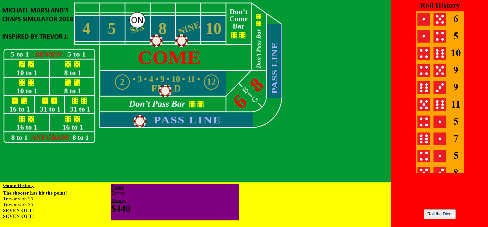

# Craps Simulator

**--ARCHIVED--**

I created this Craps simulator back in 2018 when my friend Trevor and I were getting into casino games. We both worked on one for like a week and then just decided to build a board in real life so both projects were abandoned.

Here is my half completed Craps Simulator. It is functional for half of the bets. It is written mostly in Object-Oriented JavaScript with and HTML and CSS front end.

### Development / Testing

In order to continue development or play for your own, clone the repository to your own computer (or download the files) and open "main.html" in Google Chrome. 
(Other web browsers may work as well but no guarantees that the styling will perform adequately). 

Enjoy!

